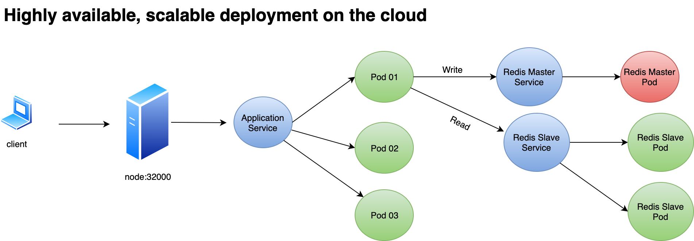

[](https://circleci.com/gh/abohmeed/birthdaygreeter)

# Description

The application is a simple API that accepts the user's name and birhdate through a PUT request to `/hello/user`. If the user's birthdate is in five days, the API responds with greeting the user and reporting that his/her birthday is in five days. If the birthday is today, the API greets the user and wishes a happy birthday.

The application must be:

* Scalable
* Highly available
* Monitored
* Run in any environment

# The Approach

The application basically has two parts: the fronetned which is facing the client, and the backend which is the data store used for saving the users' data.

## The programming language: Go

For the frontend I chose Go for the following reaosons:

* It's generally faster than other counterparts like Python or JavaScript
* The executable is just one binary file. Hence, we avoid managing multiple libarary dependencies stored in different locations.
* It can run on Linux, Windows, and macOS
* Since it can be statically compiled, we can use an empty `scratch` Docker image to run the program. We can use a multi-stage Docker build to produce a tiny image (the resulting image was 14 MB only)

## The backend: Redis

There are many choices when it comes to storing data. The only information that the application is handlign is the username and the birthdate, so we could a NoSQL database like MongoDB. However, I decided that Redis is much ligher, faster, and perfectly fits our needs. Since the application must be highly available, I used a Redis cluster.

## The Orchestration system: Kubernetes

Kubernetes is the indudtry leader when it comes to container orchestration. It is backed by Google and has a lot of community support. The application can be deployed on Kubernetes in one of two ways:

* Manually by creating the service, deployment, and configMap
* Automatically by using the Helm chart provided in the repo (more on that later)

## The Architecture Diagram 



# Installation

## Running the application natively

You can build and run the application without using containers. 

### Installing the dependencies:

Golang must be installed on your machine first. You can build the app as follows:

```bash
cd src/github.com/abohmeed/birthdaygreeter
go get github.com/gomodule/redigo/redis
go get github.com/gorilla/mux
```

#### Building for Windows

```bash
env GOOS=windows GOARCH=amd64 go build package-import-path -o app
```

#### Building for Linux

```bash
env GOOS=linux GOARCH=amd64 go build package-import-path -o app
```

#### Building for macOS

```bash
env GOOS=darwin GOARCH=amd64 go build package-import-path -o app
```

#### Statically building the application

If you want to statitcally build the application for Linux, you should use the following command:

```bash
CGO_ENABLED=0 GOOS=linux go build -a -installsuffix cgo -ldflags '-extldflags "-static"' -o app
```

The above command is the one I used to build the application so that I can use the resulting binary in a `scratch` Docker imaeg that contains no libraries.

### Installing Redis

The application expects to find a Redis server running on `localhost:6379`. However, you **must** set a password for the Redis server and export it as an environment variable as follows:

```
export REDIS_PASSWORD=[password]
```

## Building the Dockerfile

There is an already build application image named `afakharany/birthdaygreeter`. But you can build your own image as follows:

```bash
docker build -t username/image_name .
docker push username/image_name
```

## Running the application on a single node

You can run the appliaton stack on a single node by using docker-compose. Both Docker and docker-compose must be installed on the machine. You can run the docker-compose file as follows:

```bash
docker-compose up -d
```

Then you can communicate with the application on `localhost` as follows:

```bash
curl localhost/hello/Ahmad
curl -X PUT localhost/hello/Ahmad -d '{"dateOfBirth":"2019-10-25"}'
```


## Running the application on the cloud

As mentioned, we are using Kubernetes for scalable, highly available deployment. We have two methods of deployment. The first step is to deploy Redis cluster. We use the Bitnaami Helm chart for this:

### Deploying the Redis cluster

This procedure was tested on GCP cluster, but it should work on other cloud providers as it is platform-agnostic. For this procedure to work, you need [kubectl](https://kubernetes.io/docs/tasks/tools/install-kubectl/) and [helm](https://helm.sh/docs/using_helm/) installed on the client machine.  We need to install [Helm](https://helm.sh/docs/using_helm/) on the client machine the we need to install Tiller on the cluster using the following command:

```bash
kubectl create serviceaccount --namespace kube-system tiller
kubectl create clusterrolebinding tiller-cluster-rule --clusterrole=cluster-admin --serviceaccount=kube-system:tiller
helm --service-account tiller
```

This will create the necessary service account and cluster role binding for Tiller to be able to deploy the stack components.

Run the following command to install Redis cluster:

```bash
helm install --name backend --set password=mypassword stable/redis
```

<u>**Important Note**</u>

You need to take note of the **chart name** because it is used automatically as a prefix for the Redis Service and Secret.

### Manual components deployment

We can deploy the application by manually deploying the deployment, service, and configmap. However, we need configure the appropriate paramters to use the Redis cluster Service and Secret as follows:

**src/k8s/deployment.yml**

Since our Redis chart name is `backend`, then the environment part of the deployment should be as follows:

```yaml
        env:
        - name: REDIS_PASSWORD
          valueFrom:
            secretKeyRef:
              name: backend-redis
              key: redis-password
```

**src/k8s/configMap**

We need to configure the name of the Redis Cluster Service in the configmap as follows (again, assuming that the Redis chart name is `backend`):

```yaml
apiVersion: v1
kind: ConfigMap
metadata:
  name: appconfig
data:
  REDIS_MASTER_HOST: backend-redis-master
  REDIS_SLAVE_HOST: backend-redis-slave
  REDIS_PORT: "6379"
```

Now, we can deploy the components as follows:

```bash
kubectl apply -f src/k8s/configMap
kubectl apply -f src/k8s/deployment.yml
```

Wait unil the pods are in the running state and then connect to the application through one of the Node ports: 

```bash
$ kubectl get nodes -o wide
NAME                                                STATUS   ROLES    AGE   VERSION          INTERNAL-IP   EXTERNAL-IP     OS-IMAGE                             KERNEL-VERSION   CONTAINER-RUNTIME
gke-standard-cluster-1-default-pool-a3ee2311-ttwm   Ready    <none>   14h   v1.15.3-gke.18   10.128.0.11   34.67.1.60      Container-Optimized OS from Google   4.19.60+         docker://19.3.1
gke-standard-cluster-1-default-pool-a3ee2311-w8vv   Ready    <none>   32h   v1.15.3-gke.18   10.128.0.10   34.67.255.231   Container-Optimized OS from Google   4.19.60+         docker://19.3.1
```

The application Service is using NodePort `32000` for external connectivity. You may want to ensure that the cloud provider's firewall enables this port. So, in our example, we can communicate with the application using the following command:

```bash
curl 34.67.1.60:32000/hello/Ahmad
```

### Automatic installation using the Helm chart

The repository contains a Helm chart for automatically deploying the application. However, you need to set the correct variables in `k8s/helm/bg-chart/values.yaml`. So, assuming that we named the Redis Chart `backend` then the `reds_chart` of the file should look as follows:

```yaml
redis_chart:
  name: backend
  port: 6379
```

You can change other settings as well like the image tag, container port, service type, etc. but the `redis_chart.name` is mandatory because it configures the Service and Secret parts of the application to use the ones provided by the Redis chart. 

Now, you can install the application using the following command:

```bash
helm install --name birthdaygreeter k8s/helm/bg-chart
```

Wait for a few moments till the pods are in the ready state and you can communicate with the API through one of the nodes IP addresses on port `32000 `or the one you configured in `values.yaml`.

# Monitoring

We used basic monitoring for this setup. In a more complex environment we could have instrumented Prometheus metrics and exposed it through the Go code and/or used one of the exporter. However, we are using rediness and liveness probes of Kubernetes for basic monitoring.

## Liveness probes

Kubernertes checks that port 80 is responding with 200 OK, Otherwise the pod is restarted. But that does not approach the inavailablity of Redis or the failure of the app container to reach it so we are using readiness probes for this.

## Readiness probes

I created a tiny Go application that is bundled with the application container. The binary tries to establish a connection with the Redis cluster (the credentials, and port are obtained from the environment variables). If the connection is not successful the program exits with the non-zero exit code, which indicates that the Pod cannot serve requests. Kubernetes restarts the Pod.

# CI/CD

In this lab I'm using CircleCI as the CI/CD platform. I created a `main_test.go` file that has functions for testing all the possible application behaviors:

* GET request for a new user
* GET request for a registered user with birthday still ahead of time
* GET request for a registered user with birhday in 5 days
* GET request for a registered user with birthday today
* PUT request for a new user with a birhdate
* Handling invalid JSON input

As soon as the code is committed to GitHub, CircleCl runs the tests on the code using `go test`. If all the tests pass, a Docker image is build and pushed to Docker Registry. The image is tagged `latest` as well as an incremental version number. We can then change the deployment image to use the new one. The Deployment uses rolling updated by default so the image will get changed with no downtime for the user.